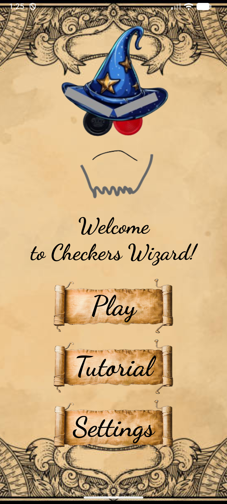
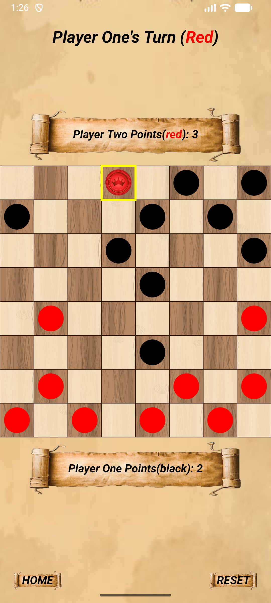
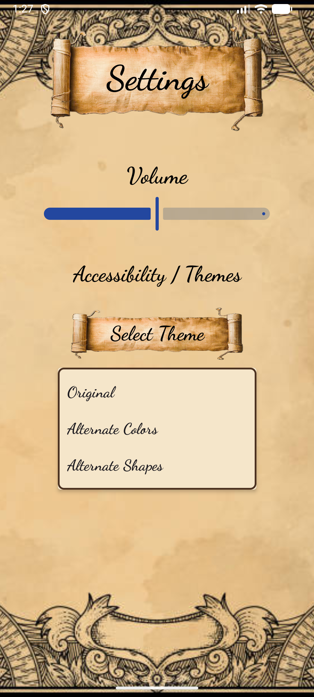

# Checkers Wizard

    
    
    

<h3 align="center"> <strong> An Android Studio implementation of Checkers, written in Kotlin </strong> 

## About

Checkers Wizard is our final submission for CS 357, Software Project Management. It is a full implementation of the game of Checkers, designed to be put on a mobile device. 

It is written in Kotlin, and uses Jetpack Compose to separate the UI design and the Logic of the program. Object Oriented Programming is used to handle checkers pieces and board states. An app navigation file is used as the core logic, to connect all of the different pages in the app.

## Features:
* Full, rules accurate implementation of Checkers (forced captures were not implemented, as that is not a rule in all versions of Checkers).
* Interactive menu to allow navigation to Checkers game, Tutorial, Settings screen.
* Tutorial, to teach newcomers how to play the game.
* Settings screen, to let users change information about the game. Currently, a music volume slider and color settings (including color accessibility settings) are implemented.
* Music plays in the background consistently (i.e., doesn't restart when screens change or when the volume is adjusted)

## How to run
Currently, the only way to run the program is to download all of the files and run the program in Android Studio. We would love to come back and create a full executable, or even put this project on the Android App Store. That may be a step for a future version of the project.